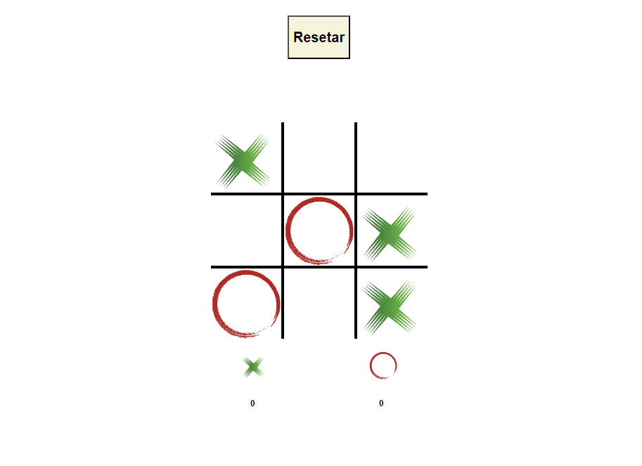

# Jogo da Velha :older_woman:

Este é o primeiro projeto criado no meu repositório do GitHub, implementado utilizando HTML, CSS e JavaScript. Trata-se de uma versão digital do clássico jogo da velha, onde dois jogadores alternam entre "X" e "O" para marcar suas jogadas em uma grade de 3x3. O objetivo é conseguir três símbolos iguais em linha horizontal, vertical ou diagonal.

## :bookmark_tabs: Instruções

1. Clone este repositório em sua máquina local `git clone`.
2. Abra o arquivo `index.html` em seu navegador da web.
3. Comece a jogar! Clique em uma célula vazia para marcar sua jogada e alterne entre "X" e "O" com o seu oponente.
4. Continue jogando até que um jogador vença ou o jogo termine em empate.
5. Para reiniciar o jogo, clique em "Resetar" ou recarregue a página no seu navegador.

## :books: Tecnologias

## Licença

[MIT](https://choosealicense.com/licenses/mit/)
